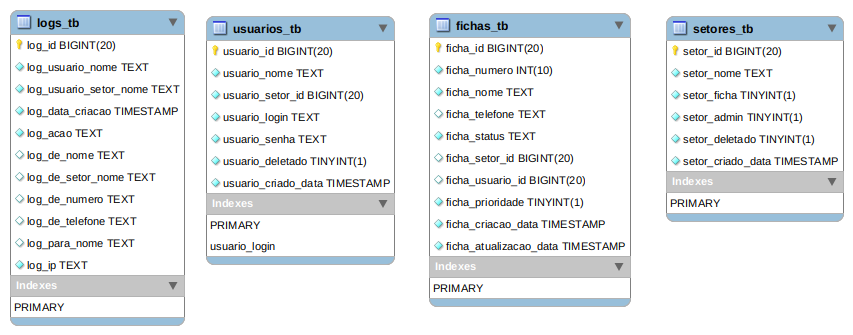

# Schema documentation

Generated by MySQL Workbench Model Documentation v1.0.0 - Copyright (c) 2015 Hieu Le

## Table: `fichas_tb`

### Description: 

Tabela com as Fichas do Sistema

### Columns: 

| Column | Data type | Attributes | Default | Description |
| --- | --- | --- | --- | ---  |
| `ficha_id` | BIGINT | PRIMARY, Auto increments, Not null |   | id da Ficha |
| `ficha_numero` | INT | Not null |   | Número de chamada da Ficha |
| `ficha_nome` | TEXT | Not null |   | Nome da Ficha |
| `ficha_telefone` | TEXT |  | `NULL` | Telefone da Ficha |
| `ficha_status` | TEXT | Not null | `'NÃO ATENDIDO'` | Status da Ficha |
| `ficha_setor_id` | BIGINT |  | `NULL` | id do Setor para qual a Ficha vai ser atendida |
| `ficha_usuario_id` | BIGINT |  | `NULL` | id do Funcionário que está atendendo a Ficha |
| `ficha_prioridade` | TINYINT | Not null |   | Se a Ficha tem prioridade no atendidmento |
| `ficha_criacao_data` | TIMESTAMP | Not null | `CURRENT_TIMESTAMP()` | Data de criação da Ficha |
| `ficha_atualizacao_data` | TIMESTAMP | Not null | `CURRENT_TIMESTAMP() ON UPDATE CURRENT_TIMESTAMP()` | Data da atualização das informações da Ficha |

### Indices: 

| Name | Columns | Type | Description |
| --- | --- | --- | --- |
| PRIMARY | `ficha_id` | PRIMARY | 'Auto incremento de id para a Ficha' |

## Table: `logs_tb`

### Description: 

Logs gerado por operações de usuários do sistema

### Columns: 

| Column | Data type | Attributes | Default | Description |
| --- | --- | --- | --- | ---  |
| `log_id` | BIGINT | PRIMARY, Auto increments, Not null |   | id do Log |
| `log_usuario_nome` | TEXT | Not null |   | Nome do Usuário que criou o Log |
| `log_usuario_setor_nome` | TEXT | Not null |   | Nome do Setor do Usuário que criou o Log |
| `log_data_criacao` | TIMESTAMP | Not null | `CURRENT_TIMESTAMP()` | Data de criação do Log |
| `log_acao` | TEXT | Not null |   | Ação do Log |
| `log_de_nome` | TEXT |  | `NULL` | Nome do Usuário ou do Setor que sofreu a Ação |
| `log_de_setor_nome` | TEXT |  | `NULL` | Caso a Ação seja para um Usuário, este é o nome do Setor dele |
| `log_de_numero` | TEXT |  | `NULL` | Número da Ficha que sofreu a Ação |
| `log_de_telefone` | TEXT |  | `NULL` | Telefone da Ficha que sofreu a Ação |
| `log_para_nome` | TEXT |  | `NULL` | Nome do Setor para onde foi encaminhado a Ficha |
| `log_ip` | TEXT | Not null |   | ip do Usuário |

### Indices: 

| Name | Columns | Type | Description |
| --- | --- | --- | --- |
| PRIMARY | `log_id` | PRIMARY |   |

## Table: `setores_tb`

### Description: 

Tabela de Setores do Sistema

### Columns: 

| Column | Data type | Attributes | Default | Description |
| --- | --- | --- | --- | ---  |
| `setor_id` | BIGINT | PRIMARY, Auto increments, Not null |   | id do Setor |
| `setor_nome` | TEXT | Not null |   | Nome do Setor |
| `setor_ficha` | TINYINT | Not null |   | Se o Setor é um gerenciador de fichas |
| `setor_admin` | TINYINT | Not null |   | Se o Setor é administrador do Sistema |
| `setor_deletado` | TINYINT | Not null | `0` | Se o Setor foi Deletado do sistema |
| `setor_criado_data` | TIMESTAMP | Not null | `CURRENT_TIMESTAMP()` | Data que o Setor foi criado |

### Indices: 

| Name | Columns | Type | Description |
| --- | --- | --- | --- |
| PRIMARY | `setor_id` | PRIMARY | 'Auto incremento de id para setor' |

## Table: `usuarios_tb`

### Description: 

Tabela de Funcionários do Sistema

### Columns: 

| Column | Data type | Attributes | Default | Description |
| --- | --- | --- | --- | ---  |
| `usuario_id` | BIGINT | PRIMARY, Auto increments, Not null |   | id do Funcionário |
| `usuario_nome` | TEXT | Not null |   | Nome do Funcionário |
| `usuario_setor_id` | BIGINT | Not null |   | id do Setor atual do Funcionário |
| `usuario_login` | TEXT | Not null, Unique |   | Login do Funcionário |
| `usuario_senha` | TEXT | Not null |   | Senha do Funcionário |
| `usuario_deletado` | TINYINT | Not null | `0` | Se o Funcionário foi deletado do sistema |
| `usuario_criado_data` | TIMESTAMP | Not null | `CURRENT_TIMESTAMP()` | Data que o Funcionário foi adicionado ao sistema |

### Indices: 

| Name | Columns | Type | Description |
| --- | --- | --- | --- |
| PRIMARY | `usuario_id` | PRIMARY | 'Auto incremento de id para usuário' |
| usuario_login | `usuario_login` | UNIQUE | 'O login do Funcionário deve ser único no sistema' |

# Map

